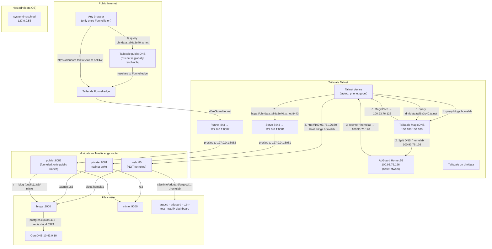

# DNS & Traffic Flows

Two DNS namespaces exist, and both resolve to the **same IP** (`100.93.76.126`,
the node's Tailscale address). What decides where traffic actually goes is the
**port** — not the name.

## The mental model

```
Name resolution  → 100.93.76.126 (always)
Port you connect on  → Traefik entrypoint
Host header + path  → the app
```

| Name | Who resolves it | Resolves to | Connect on | Entrypoint |
|---|---|---|---|---|
| `*.homelab` (e.g. `blogs.homelab`) | AdGuard split-DNS (tailnet only) | `100.93.76.126` | **80** | `web` |
| `dhridata.tail6a3e40.ts.net` | Tailscale MagicDNS (tailnet) **and** Tailscale public DNS (internet) | `100.93.76.126` | **443** (Funnel) | `public` :8082 |
| `dhridata.tail6a3e40.ts.net` | same as above | `100.93.76.126` | **8443** (Serve) | `private` :8081 |

So `dhridata.tail6a3e40.ts.net:443` and `:8443` reach *different* entrypoints of
the *same* hostname — the port is the router.

## Diagram



## The three independent DNS paths (unchanged)

| Path | Resolver | Scope |
|---|---|---|
| Tailnet devices | AdGuard (100.93.76.126:53) | `*.homelab` → Tailscale IP |
| Pods | CoreDNS (10.43.0.10) | `<svc>.<ns>.svc.cluster.local` — `.homelab` is **NXDOMAIN** in-cluster |
| Host | systemd-resolved (127.0.0.53) | upstream 1.1.1.1 |

Pods never use `.homelab` — the blog connects to `postgres.cloud:5432`, not
`postgres.homelab`.

## Common confusion

- **Same IP, different result** — `100.93.76.126` is the answer to both
  `blogs.homelab` and `dhridata.tail6a3e40.ts.net`. The port (`80`/`443`/`8443`)
  picks the Traefik entrypoint, then Host+path picks the app.
- **`.ts.net` is not only MagicDNS** — the same name is resolvable on the public
  internet by Tailscale's DNS, which is what makes Funnel work without a public
  DNS entry.
- **Funnel exposes only `public` :8082** — no amount of Host-header tricks can
  reach `web` :80 routes (argocd, adguard, etc.) from the internet.

See also: [exposure.md](./exposure.md) for the full route table,
[knowledge.md](./knowledge.md#dns-architecture) for the original design.
